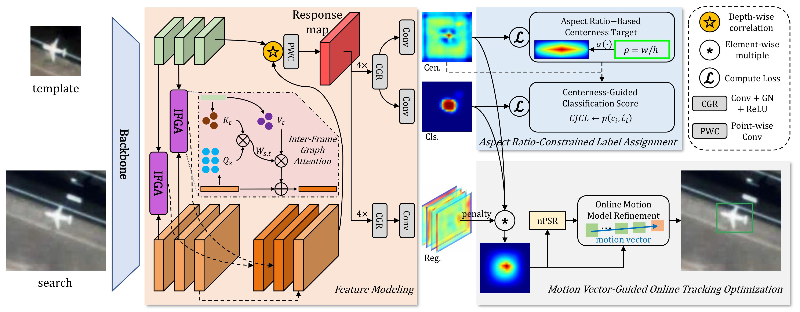

# SiamGM: Siamese Geometry-Aware and Motion-Guided Network for Real-Time Satellite Video Object Tracking

> SiamGM: Siamese Geometry-Aware and Motion-Guided Network for Real-Time Satellite Video Object Tracking
>
> [https://arxiv.org/abs/2603.07564](https://arxiv.org/abs/2603.07564)

Codes comming soon!

## Abstract

Single object tracking in satellite videos is inherently challenged by small target, blurred background, large aspect ratio changes, and frequent visual occlusions. These constraints often cause appearance-based trackers to accumulate errors and lose targets irreversibly. To systematically mitigate both spatial ambiguities and temporal information loss, we propose SiamGM, a novel geometry-aware and motion-guided Siamese network. From a spatial perspective, we introduce an Inter-Frame Graph Attention (IFGA) module, closely integrated with an Aspect Ratio-Constrained Label Assignment (LA) method, establishing fine-grained topological correspondences and explicitly preventing surrounding background noise. From a temporal perspective, we introduce the Motion Vector-Guided Online Tracking Optimization method. By adopting the Normalized Peak-to-Sidelobe Ratio (nPSR) as a dynamic confidence indicator, we propose an Online Motion Model Refinement (OMMR) strategy to utilize historical trajectory information. Evaluations on two challenging SatSOT and SV248S benchmarks confirm that SiamGM outperforms most state-of-the-art trackers in both precision and success metrics. Notably, the proposed components of SiamGM introduce virtually no computational overhead, enabling real-time tracking at 130 frames per second (FPS). Codes and tracking results are available at [https://github.com/wenzx18/SiamGM](https://github.com/wenzx18/SiamGM).



## Results

Results can be downloaded from: [Google Drive](https://drive.google.com/drive/folders/1wA-kQ_2gJe4dtK84B_VLtATMBdB7k74U?usp=drive_link)

## Citation

If you find this repository/work helpful in your research, welcome to cite our paper:

```bibtex
@article{wen2026siamgm,
  title={{SiamGM: Siamese Geometry-Aware and Motion-Guided Network for Real-Time Satellite Video Object Tracking}},
  author={Zixiao Wen and Zhen Yang and Jiawei Li and Xiantai Xiang and Guangyao Zhou and Yuxin Hu and Yuhan Liu},
  journal={arXiv preprint arXiv:2603.07564},
  year={2026}
}
```
